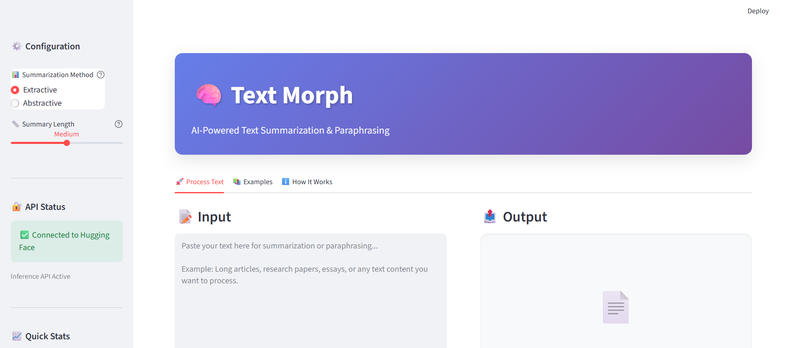
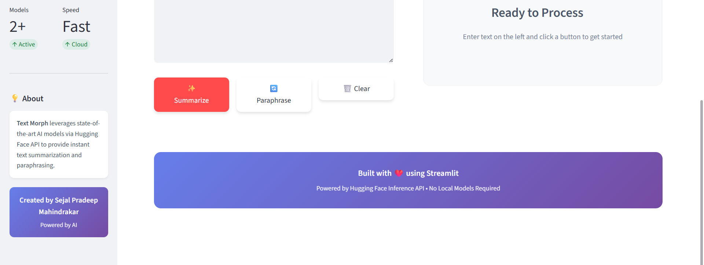

# 🧠 Text Morph - AI Text Summarization & Paraphrasing

<div align="center">


*An AI-powered web app that helps you summarize and paraphrase text quickly and easily.*

</div>

## 📸 Screenshots

Here is a preview of Text Morph interface:




## 📋 Table of Contents

- [🎯 Project Overview](#-project-overview)
- [✨ Features](#-features)
- [🛠️ Technologies Used](#️-technologies-used)
- [🤖 AI Models](#-ai-models)
- [🚀 Quick Start](#-quick-start)
- [🔄 Usage](#-usage)
- [📈 Project Structure](#-project-structure)
- [🎨 UI Features](#-ui-features)
- [🤝 Contributing](#-contributing)
- [📄 License](#-license)

## 🎯 Project Overview

**Text Morph** is a smart AI text tool that lets you shorten and rephrase long text.  
It uses NLP models including Facebook's **BART** and Meta's **LLaMA 3.1** to provide:

1. **Summarization**: Condense text using extractive or abstractive methods  
2. **Paraphrasing**: Rephrase content naturally without changing meaning

The interface is simple, modern, and interactive using Streamlit. Ideal for students, writers, and professionals needing fast text processing.

## ✨ Features

### 🎨 Modern Interface
- Gradient-based purple theme with smooth design
- Tabs for **Process Text**, **Examples**, **How It Works**
- Mobile-friendly layout
- Live character, word count, and reduction percentage
- Smooth button hover effects

### 🤖 AI Processing
- **Two summarization modes**: Extractive & Abstractive
- **Paraphrasing**: Multiple alternative phrasings
- Choose summary length: Short, Medium, Long

### ⚡ Convenience
- Fast results (2-5 sec)
- Cloud-based (no local model downloads)
- Download summaries & paraphrases as `.txt`
- API status indicator for Hugging Face and GROQ

## 🛠️ Technologies Used

| Technology | Purpose |
|------------|---------|
|  | Core programming language |
|  | Web app framework |
|  | BART model API access |
|  | LLaMA model API |
|  | HTTP calls to APIs |
|  | Manage environment variables |
|  | Custom styles & animations |

## 🤖 AI Models

### BART (Facebook AI)
- Model: `facebook/bart-large-cnn`
- Used for: Summarization (extractive & abstractive)
- Strength: Understands context, accurate summaries

### LLaMA 3.1 (Meta AI)
- Model: `llama-3.1-8b-instant`
- Used for: Paraphrasing
- Strength: Fast, maintains meaning, multiple variations

## 🚀 Quick Start

### Prerequisites
- Python 3.8+
- Hugging Face API key
- GROQ API key

### Installation
1. **Clone repo:**
   ```bash
   git clone https://github.com/yourusername/text-morph.git
   cd text-morph
   ```

2. **Create virtual environment**
   ```bash
   # Windows
   python -m venv venv
   venv\Scripts\activate

   # macOS/Linux
   python3 -m venv venv
   source venv/bin/activate
   ```

3. **Install dependencies**
   ```bash
   pip install -r requirements.txt
   ```

4. **Set up API keys**
   
   Create a `.env` file in the project root:
   ```env
   HF_API_KEY=your_huggingface_api_key_here
   GROQ_API_KEY=your_groq_api_key_here
   ```

   **Get your API keys:**
   - Hugging Face: https://huggingface.co/settings/tokens
   - GROQ: https://console.groq.com/keys

5. **Launch the application**
   ```bash
   streamlit run app.py
   ```

## 🔄 Usage

Once the setup is complete, you can start using Text Morph.

**1. Run the Streamlit App**

In your terminal, navigate to the project's root directory and run:
```bash
streamlit run app.py
```

**2. Access the Application**

Your default web browser will open automatically at `http://localhost:8501`

**3. Configure Settings (Sidebar)**
-   Select **Summarization Method**: Extractive or Abstractive
-   Choose **Summary Length**: Short, Medium, or Long
-   View **API Status** and quick stats

**4. Process Your Text**
-   Navigate to the **🚀 Process Text** tab
-   Paste or type your text in the input area
-   Click **✨ Summarize** for text summarization
-   Click **🔄 Paraphrase** for text paraphrasing
-   View real-time metrics (word count, character count, reduction %)

**5. Download Results**
-   Click the **⬇️ Download** button to save your results as a .txt file

**6. Explore Examples**
-   Check the **📚 Examples** tab for use case ideas
-   Read the **ℹ️ How It Works** tab for detailed explanations

## 📈 Project Structure

```
TEXT_MORPH/
│
├── assets/                  # Images & static files
│   ├── screenshot1.png
│   └── screenshot2.png
├── configure/               # Configuration
│   ├── config_manager.py
│   └── config.yaml
├── docs/                    # Documentation
│   ├── API_Docs.md
│   └── Technical_Report.md
├── src/                     # Source code
│   ├── __init__.py
│   ├── AbstractiveSummarizer.py
│   ├── combinedPipeline.py
│   ├── exceptions.py
│   ├── ExtractiveSummarizer.py
│   ├── logging_system.py
│   └── paraphraser.py
├── app.py
├── requirements.txt
├── pyproject.toml
├── .gitignore
└── README.md

```

## 🎨 UI Features

### Header Section
-   **Gradient Background**: Beautiful purple gradient (#667eea to #764ba2)
-   **Bold Branding**: Large "Text Morph" title with crystal ball emoji
-   **Clear Subtitle**: "AI-Powered Text Summarization & Paraphrasing Platform"

### Sidebar Components
-   **⚙️ Configuration Panel**: Method and length selection with helpful tooltips
-   **🔐 API Status**: Real-time connection indicator
-   **📈 Quick Stats**: Live metrics for active models and processing speed
-   **💡 About Section**: Project information card
-   **Creator Badge**: Professional footer with creator name

### Main Interface
-   **Tab Navigation**: Three organized tabs for different purposes
-   **Two-Column Layout**: Input on left, output on right
-   **Real-Time Stats**: Character and word counting
-   **Empty State**: Beautiful placeholder when no content
-   **Feature Cards**: Hover-animated cards showcasing use cases
-   **Download Integration**: One-click export functionality

### Visual Design Elements
-   Custom CSS with smooth transitions
-   Hover effects on buttons and cards
-   Professional color scheme
-   Responsive grid layouts
-   Shadow effects for depth
-   Rounded corners throughout

## 🤝 Contributing

Contributions are welcome! Here's how you can help:

1. Fork the repository
2. Create feature branch (`git checkout -b feature/NewFeature`)
3. Commit changes (`git commit -m 'Add Feature'`)
4. Push branch (`git push origin feature/NewFeature`)
5. Open a Pull Request

### Contribution Ideas:
- Dark mode toggle
- Multi-language support
- PDF/DOCX file upload
- Batch processing 
- History tracking 
- Additional theme options
- New AI model options
- Progressive Web App (PWA) features

## 📄 License

This project is licensed under the MIT License - see the [LICENSE](LICENSE) file for details.

---

<div align="center">

### If you found this project helpful, please give it a star! ⭐

**Created by Sejal PM | Powered by AI**

[Report Bug](https://github.com/yourusername/text-morph/issues) · [Request Feature](https://github.com/yourusername/text-morph/issues)

</div>

---
=======
# Text_Morph
AI-Powered Text Summarization &amp; Paraphrasing Application
>>>>>>> 3493c041c105889bc6090b03b14c532dfed1dac4
